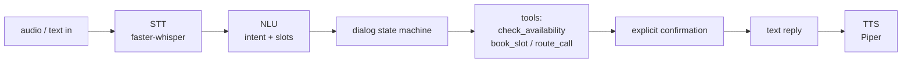

# Voice / Conversational-AI POC — appointment booking + call routing

[](https://github.com/VMG-Emjan/Test/actions/workflows/ci.yml)

A **$0, verifiable** voice-agent proof: a provider-agnostic **NLU → dialog → tool →
confirmation** core for two receptionist tasks — **booking appointments** and
**routing calls** to a department — wrapped in a **real local speech pipeline**
(faster-whisper STT + Piper TTS) and adapters for **LiveKit** (primary),
**Vapi**, and **Retell**.

This is a **POC**, not a production system. Every claim below is backed by a command
you can re-run; nothing is a mockup.

## What is actually verified

| Capability | Status | Evidence |
|---|---|---|
| Deterministic NLU + dialog + tools (46 tests) | ✅ Verified | `pytest -q`, `tests/` |
| Booking writes to `appointments.json`, double-booking guarded | ✅ Verified | `tests/test_tools_storage.py`, `artifacts/level-a/booking/` |
| Call routing decision (labeled as simulation) | ✅ Verified | `artifacts/level-a/routing/` |
| **Local voice pipeline**: real STT → dialog → tool → real TTS → booked | ✅ Verified (synthetic audio) | `artifacts/level-b/` (transcript + 10 wavs + hashes) |
| Local-LLM NLU (Ollama, OpenAI-compatible) | ⚠️ Unverified | code in `providers/openai_compatible.py`; needs `ollama serve` |
| Live microphone + VAD barge-in + LiveKit room | ⚠️ Unverified | opt-in code in `providers/livekit/agent.py` |
| Vapi / Retell config | 🧩 Schema-validated only | `tests/test_provider_configs.py`; not deployed |

> **Honesty note.** Level-B input audio is **synthetic** (Piper), not a human
> microphone, so it proves the STT→…→TTS chain runs end to end but not live-mic
> barge-in. The router returns a routing **decision** (simulation), not a real
> telephony transfer. Unverified items are labeled, never dressed up.

## Architecture



The LLM only **proposes** structured intent/slots; the state machine validates them
and decides which tool to call. The LLM never writes files or invents availability.

## Run it

### Level-A — deterministic core (no keys, no network)
```bash
pip install -e ".[dev]"
pytest -q                                   # 46 tests
python -m voice_agent.cli --nlu deterministic
# reproduce the recorded evidence:
python scripts/run_text_demo.py --scenario booking --record artifacts/level-a
python scripts/verify_artifacts.py artifacts/level-a
```
PowerShell is identical (`pip`, `python`, `pytest` on PATH).

### Level-B — real local voice pipeline (synthetic audio)
```bash
pip install -e ".[voice]"
python -m piper.download_voices en_US-amy-medium --download-dir models
# bash:
PIPER_VOICE_MODEL=models/en_US-amy-medium.onnx python scripts/run_voice_demo.py --record artifacts/level-b
```
```powershell
# PowerShell:
$env:PIPER_VOICE_MODEL="models/en_US-amy-medium.onnx"; python scripts/run_voice_demo.py --record artifacts/level-b
```
Produces `artifacts/level-b/transcript.md`, `session.jsonl`, per-turn `.wav` files,
`run-metadata.json`, and `checksums.sha256`. Re-verify with
`python scripts/verify_artifacts.py artifacts/level-b`.

### Local-LLM NLU (optional)
```bash
ollama serve && ollama pull llama3.2:1b
pip install -e ".[llm]"
python -m voice_agent.cli --nlu local-llm
```

### Live LiveKit room (opt-in) / Vapi / Retell
See `providers/livekit/`, `providers/vapi/`, `providers/retell/`. These need
provider accounts/keys and — for phone calls — paid numbers, so they are **off by
default** and labeled Unverified.

## How the evidence is produced
Transcripts and logs are **never hand-written**. `scripts/run_*_demo.py` drive the
real agent, capture the structured event log, and write `run-metadata.json` (git SHA,
command, component versions) plus `checksums.sha256`. `scripts/verify_artifacts.py`
recomputes the hashes so anyone can confirm the committed evidence was not edited
after the run. CI green means code/test health — it is **not** a substitute for the
voice evidence.

## Privacy & demo data
No secrets or real customer data in the repo. `.env` and model weights are
gitignored. All demo names (John Smith, Çağrı, …) are synthetic test data.

## Limitations
- Live microphone capture + VAD barge-in + a live LiveKit room: **not run here**.
- Level-B input is synthetic TTS audio; spoken numerics can transcribe oddly
  (e.g. "15:00" → "$1500"), so demo phrasing uses forms that round-trip cleanly.
- Vapi/Retell configs are schema-valid but undeployed.
- Not production-hardened (no auth, rate limiting, or real calendar backend).
